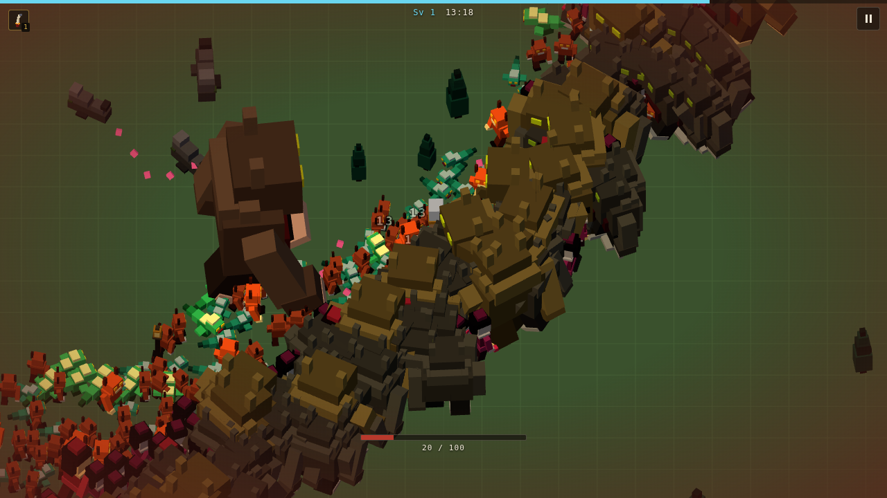
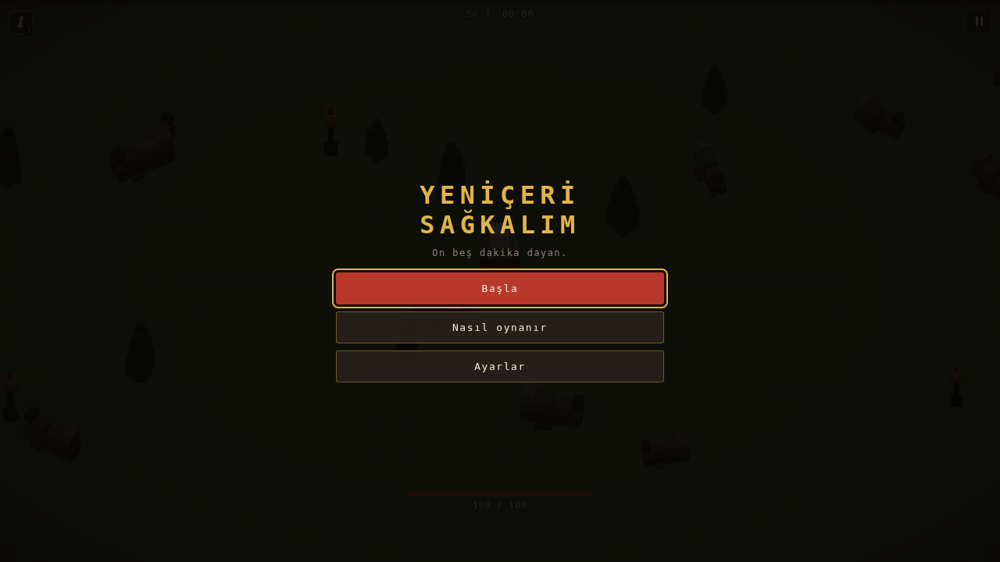
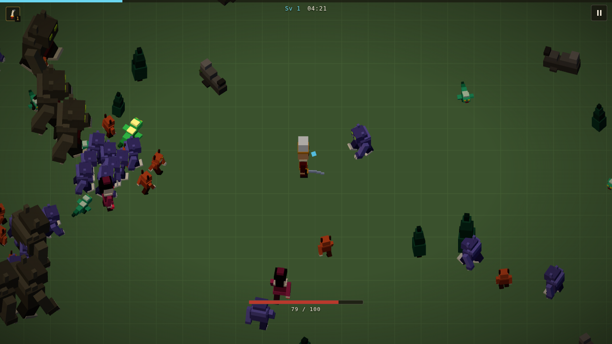
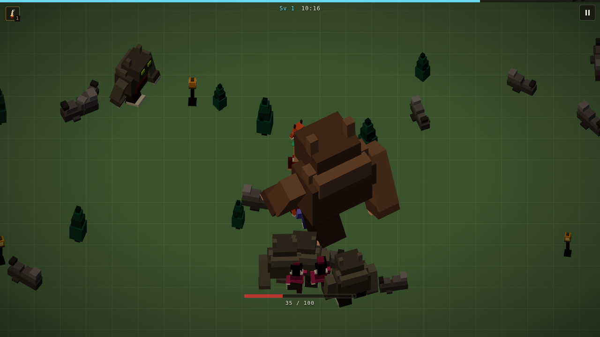
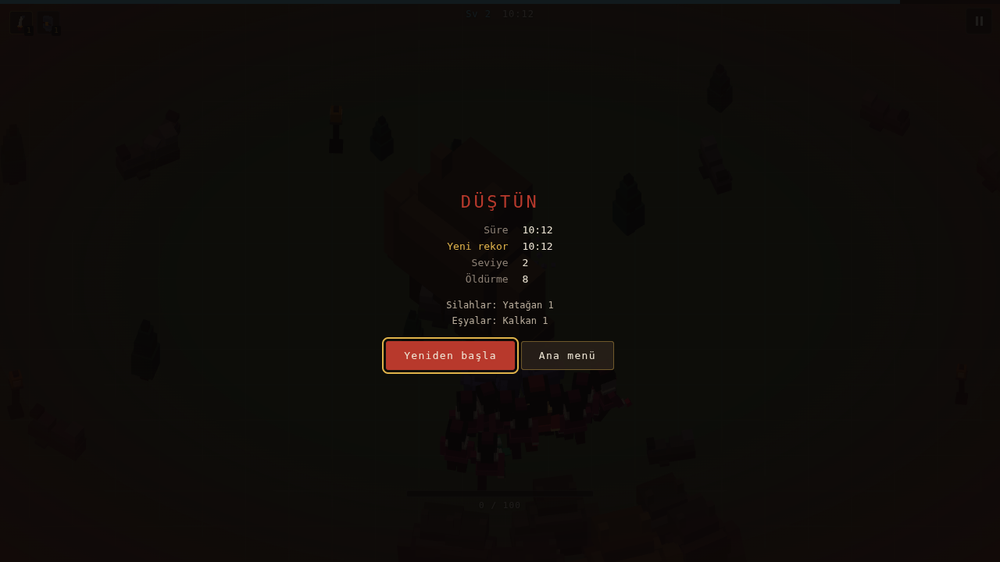

# Janissary Survivor

Yeniçeri konseptli, fantastik/mitolojik Osmanlı temalı, **Vampire Survivors**
mekaniklerine dayanan 3D tarayıcı oyunu.

Silahların kendiliğinden ateşlenir. Senin işin nereye durmayacağına karar
vermek, ve her seviyede üç karttan birini seçmek. On beş dakika dayanırsan
kazanırsın.



> Durum: **MVP tamam** — Faz 0'dan 8'e kadar hepsi bitti.
> Ayrıntılı plan, her fazın sapmaları ve gerekçeleri için
> [ROADMAP.md](ROADMAP.md).

> [!IMPORTANT]
> **Canlı demo henüz yayında değil.** Pages deploy workflow'u hazır ama tek
> seferlik bir el işi bekliyor: **Settings → Pages → Source: "GitHub Actions"**.
> Bu adım otomatikleştirilemiyor; Pages sitesi oluşturmak repo admin yetkisi
> istiyor, workflow'un `GITHUB_TOKEN`'ı ise `permissions: pages: write`
> verilse bile buna sahip değil. Anahtar çevrilene kadar deploy workflow'u her
> push'ta bu adımda kırmızı kalır — bu kasıtlı, kurulumun eksik olduğunu
> gösteren sinyal. Çevrildikten sonra push'lar otomatik yayına gider.

## Öne çıkanlar

- **Hiç binary asset yok.** Modeller `data/models/*.json` içinde veri olarak
  yaşar ve kodla geometriye çevrilir; sesler oscillator ve filtrelerden
  sentezlenir. İndirilecek `.glb` ya da `.wav` yok, git-diff'i okunabilir bir
  repo var.
- **Yüzlerce düşman, 60'ın altında draw call.** Sürü `class` örnekleri değil
  paralel `Float32Array`'ler; her düşman modeli tek bir `InstancedMesh`, yürüme
  animasyonu GPU'da.
- **Simülasyon renderer'dan bağımsız.** `src/sim/` içinde `three` import
  edilmez — ESLint kuralıyla zorunlu tutulur. Oyun mantığının tamamı tarayıcı
  olmadan test edilir.
- **Denge tamamen veri.** Silahlar, düşmanlar, pasifler ve dalga tablosu
  `data/balance/*.json` içinde. Zorluk eğrisini değiştirmek bir kod
  değişikliği değil, bir tablo düzenlemesi.

## Oynanış

| Ne            | Nasıl                                                    |
| ------------- | -------------------------------------------------------- |
| Hareket       | WASD / ok tuşları, kol çubuğu (sol analog + d-pad)       |
| Mobil         | Ekranda parmağını sürükle — sanal çubuk parmağın altında |
| Duraklat      | Esc / P, kolda Start, mobilde sağ üstteki düğme          |
| Saldırı       | Otomatik                                                 |
| Seviye atlama | Mücevher topla, üç karttan birini seç                    |

Altı silah, sekiz pasif eşya, beş düşman tipi ve bir boss. Onuncu ve on
dördüncü dakikada **Gulyabani Ağası** gelir; slam'ini yerdeki halkadan
görürsün, halka gerçek menzilini gösterir ve içindeki disk sana ne kadar
kaldığını söyler.

<table>
  <tr>
    <td width="50%"></td>
    <td width="50%"></td>
  </tr>
  <tr>
    <td></td>
    <td></td>
  </tr>
</table>

## Özet

- **Platform:** Web (tarayıcı), masaüstü öncelikli, mobil çalışır
- **Teknoloji:** Three.js + TypeScript + Vite
- **Görsel stil:** Prosedürel voxel (Minecraft benzeri)
- **Kamera:** Top-down, hafif eğimli ortografik (~55°)
- **Ses:** WebAudio ile sentezlenmiş; mehter esinli, Hicaz makamında
  zamanlanmış döngü
- **MVP:** Tek harita, 15 dakikalık run, meta-progression yok

## Geliştirme

Node 22 gerekir (bkz. `.nvmrc`).

```bash
npm install
npm run dev      # http://localhost:5173
```

| Komut              | Ne yapar                                        |
| ------------------ | ----------------------------------------------- |
| `npm run dev`      | Vite geliştirme sunucusu, HMR açık              |
| `npm run build`    | Tip kontrolü + üretim build'i (`dist/`)         |
| `npm run preview`  | Build edilmiş çıktıyı yerelde sunar             |
| `npm test`         | Vitest birim testleri                           |
| `npm run test:e2e` | Playwright smoke testi (build eder ve oynar)    |
| `npm run check`    | Tip + lint + format + test — CI'ın çalıştırdığı |

`npm run check` push öncesi çalıştırılması beklenen komuttur. `test:e2e` ondan
ayrı tutuldu, çünkü `check` her kaydetmede çalışacak kadar hızlı olmalı;
smoke testi ise oyunu build edip bir dakika boyunca gerçekten oynar. CI ikisini
de çalıştırır.

Ortamda hazır bir Chromium varsa smoke testi onu kullanabilir:

```bash
CHROMIUM_PATH=/yol/chrome npm run test:e2e
```

### URL parametreleri

| Parametre       | Etki                                                             |
| --------------- | ---------------------------------------------------------------- |
| `?debug=1`      | Frame süresi ve sahne sayaçları overlay'i (dev'de zaten açık)    |
| `?seed=x`       | Manzarayı, spawn'ları ve kart tekliflerini sabitler              |
| `?go=1`         | Başlık ekranını atlar, doğrudan run'a girer                      |
| `?start=SANIYE` | Saati ileriden başlatır — geç roster'ı ya da bossu görmek için   |
| `?enemies=N`    | Kalabalığı tabloyu ezerek sabitler — kare bütçesi ölçümü için    |
| `?scene=models` | Model vitrini: animasyon seçici, geometri ve draw call sayaçları |

## Mimari

Ayrıntılar [ROADMAP.md](ROADMAP.md) § 2'de. Günlük çalışmayı etkileyen tek
kural:

> **`src/sim/` içinde `three` import edilmez.**

Simülasyon renderer'dan bağımsız kalır ki oyun mantığı tarayıcı olmadan test
edilebilsin. Bu kural ESLint tarafından zorunlu tutulur
(`no-restricted-imports`), yani ihlal CI'da hata verir. Aynı gerekçeyle `src/`
içinde `process` kullanılamaz: tarayıcıda yoktur, ama Node tipleri yüklü
olduğu için tip kontrolünden geçer ve ancak oyuncunun önünde patlardı.

```
src/
  core/    saat, girdi, RNG, ayarlar, string tablosu — renderer'dan bağımsız
  sim/     oyun mantığı; three import ETMEZ, tamamen test edilebilir
  render/  three.js: kamera, voxel builder, sürü, efektler
  audio/   WebAudio: bağlam, sentezlenmiş efektler, mehter döngüsü
  ui/      DOM overlay: HUD, kabuk, kartlar, özet
  scenes/  sahneler ve yönlendirme
  dev/     geliştirici araçları (perf overlay)
data/
  models/  voxel model tanımları (JSON)
  balance/ silah / düşman / pasif / dalga tabloları (JSON)
tests/     *.test.ts → Vitest (tarayıcısız), *.spec.ts → Playwright
```

## Bilinen sınırlar

- **FPS bu repoda doğrulanmadı.** CI ve geliştirme ortamında GPU yok; headless
  Chromium SwiftShader ile yazılımdan çiziyor. Ölçülen kare süreleri
  SwiftShader hakkında bir şey söyler, oyuncunun makinesi hakkında hiçbir şey.
  Bu yüzden smoke testi kasıtlı olarak FPS hakkında hiçbir iddiada bulunmaz.
- **Bloom yok.** Vinyet bir DOM katmanı olarak çizilir (bedava); gerçek bir
  bloom zinciri kare başına birkaç ek geçiş demek, ve bu ortamda ölçemeyeceğim
  bir maliyeti, tamamen kare bütçesi üzerine kurulmuş bir projeye eklemek
  yanlış olurdu. Parlama yerine zaten additive çizilen mermi, aura ve boss
  halkası çalışıyor.
- **Meta-progression yok.** Kapsam dışı. `localStorage`'da sadece ayarlar ve en
  iyi süre tutulur; en iyi süre hiçbir şeyin kilidini açmaz.

## Lisans

Henüz belirlenmedi.
